# NetStock

Gestionale di magazzino per materiale di rete (Cisco, Meraki, Palo Alto, alimentatori, transceiver, cavi), pensato per un piccolo team IT. Nessuna dipendenza da servizi cloud: gira interamente su una singola VM Ubuntu Server con Docker Compose.

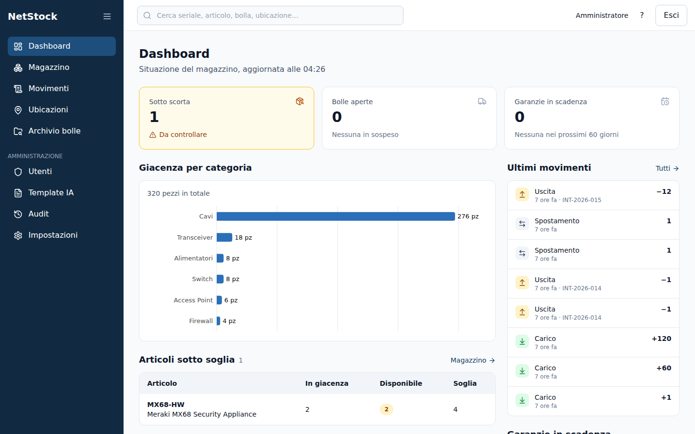

La regola che tiene insieme tutto il resto: **ogni pezzo che entra o esce lascia una riga in un registro che non si può riscrivere**. Chi, quando, da dove a dove, con quale bolla. Non c'è una schermata che permetta di «sistemare» una giacenza: si registra un movimento, e se un movimento è sbagliato si storna — così restano scritti sia l'errore sia la correzione. Il database stesso lo impone, non solo il codice: il ruolo con cui gira l'applicazione non ha il permesso di modificare o cancellare quelle righe.

> Le schermate di questa pagina vengono da un'istanza dimostrativa con dati inventati: seriali `DMO…`, «Magazzino dimostrativo», fornitori di fantasia. Nessuna immagine viene da un magazzino in uso.

## Cosa fa, schermata per schermata

### Ricevere la merce senza lasciare la tastiera

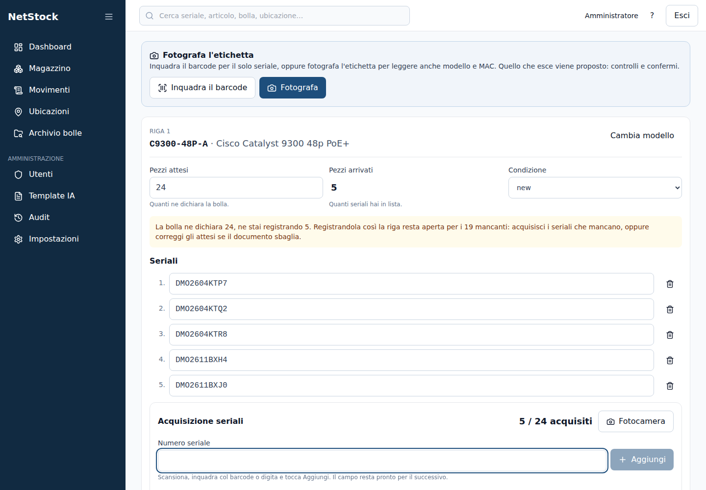

È la schermata su cui il resto è costruito. Arriva un bancale con ventiquattro switch: si sceglie la bolla (o la si crea lì), si dice dove va la merce, si sceglie il modello, e poi **si spara un seriale dopo l'altro col lettore di codici a barre**. Il campo resta pronto per il successivo: nessun clic fra un pezzo e l'altro. Il contatore dice `5 / 24` e la riga resta aperta finché i conti non tornano.

Se il documento dichiara ventiquattro pezzi e ne arrivano diciannove, il sistema **non nasconde la differenza**: la scrive, registra quello che è arrivato davvero e lascia la riga aperta per il resto. Un seriale già a magazzino viene rifiutato sul momento, non a fine registrazione.

La bolla si può anche **fotografare**: da una foto, una scansione o un PDF il sistema propone le righe da ricevere. Chi decide cosa, però, è stabilito e non negoziabile — vedi [Estrazione AI](#estrazione-ai-gpu-facoltativa).

### Il magazzino, in una tabella sola

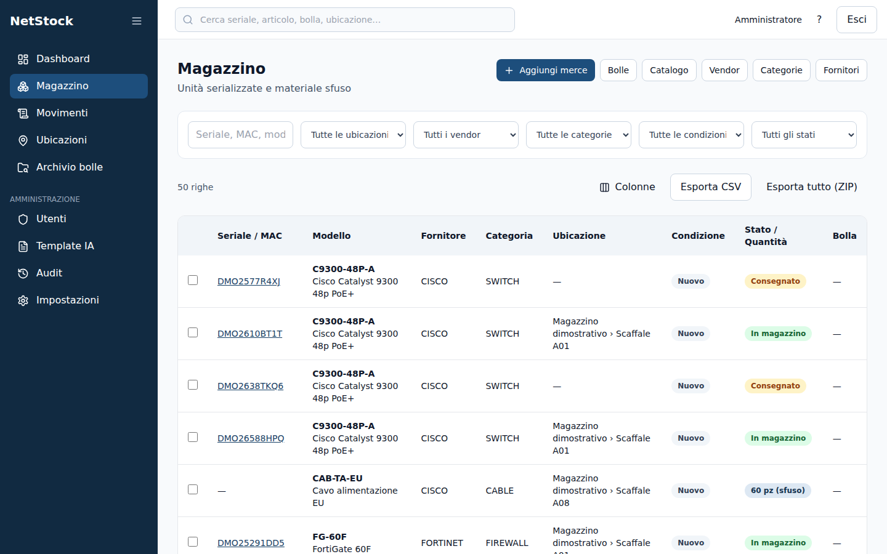

Pezzi serializzati e materiale sfuso nella stessa vista: uno switch con il suo seriale è una riga, i centoventi patch cord in uno scaffale sono una riga con la quantità. Filtri per ubicazione, fornitore, categoria, condizione e stato; ricerca per seriale, MAC, modello o numero di bolla.

Le colonne si scelgono (`Colonne`) e la scelta resta su quel computer. **L'esportazione CSV porta tutto**, anche le colonne nascoste: quello che si nasconde è per guardare meglio, non per esportare di meno. `Esporta tutto (ZIP)` scarica l'intero magazzino in undici file CSV, uno per tabella, con un `LEGGIMI.txt` che spiega cosa c'è dentro.

### La storia di un singolo apparato

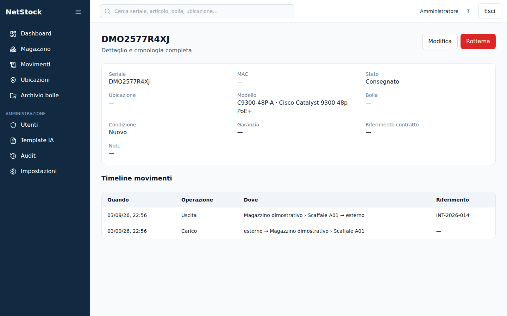

Ogni pezzo serializzato ha la sua pagina: dove si trova, in che stato è, da quale bolla è arrivato, quando scade la garanzia — e sotto, **la cronologia completa**, dal carico a oggi. È la risposta alla domanda che di solito costa mezz'ora di telefonate: *dov'è finito questo switch?*

### Il registro dei movimenti

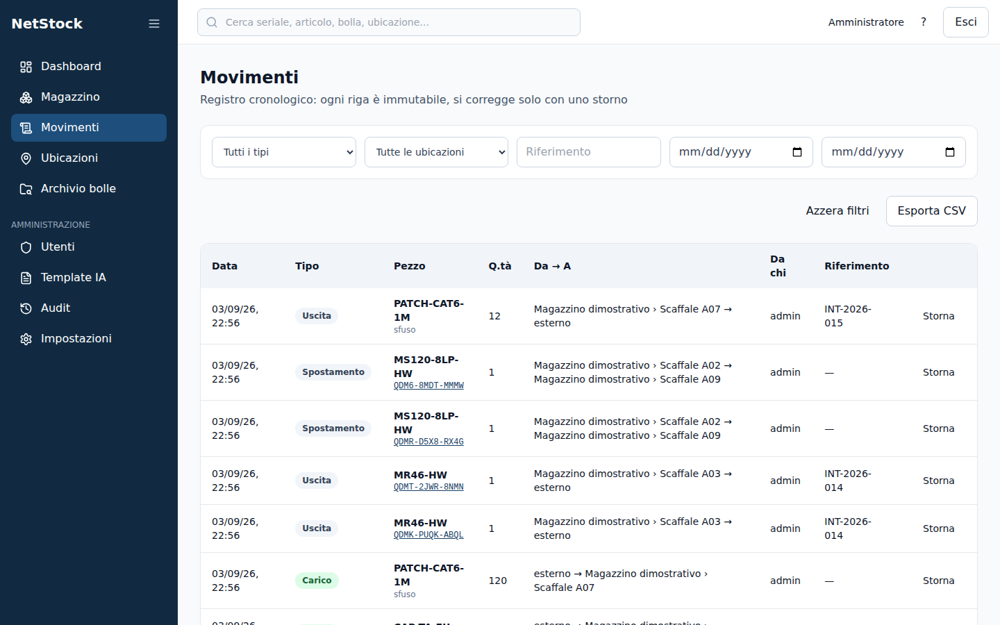

Tutto quello che è successo, in ordine, filtrabile per periodo, tipo, articolo, ubicazione o riferimento — ed esportabile. Un movimento sbagliato non si cancella: si **storna**, e restano scritti l'errore, la correzione e il motivo.

### Le ubicazioni

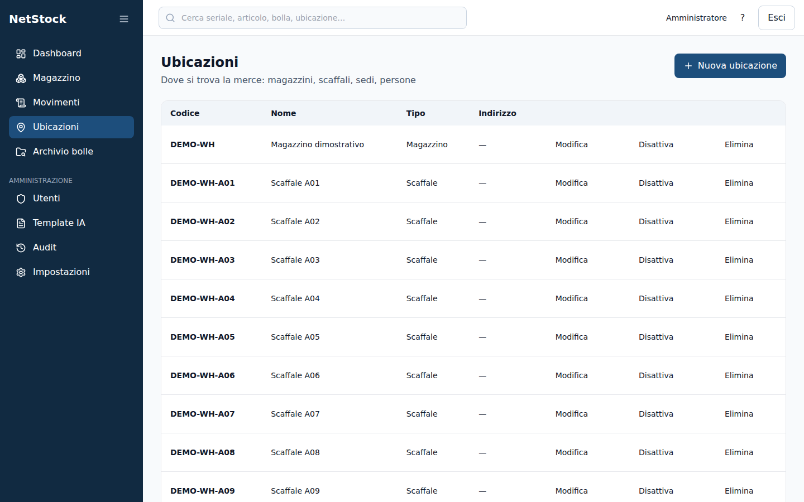

Magazzini, scaffali, aree di transito e RMA, ad albero. Il nome si scrive per esteso («Scaffale A01») e **il codice lo ricava il sistema**: un codice battuto a mano diventa presto un codice sbagliato, e da lì in poi metà magazzino sta nel posto sbagliato. Ovunque nell'applicazione l'ubicazione compare per esteso, con il suo percorso: *Magazzino dimostrativo › Scaffale A01*.

### L'archivio delle bolle

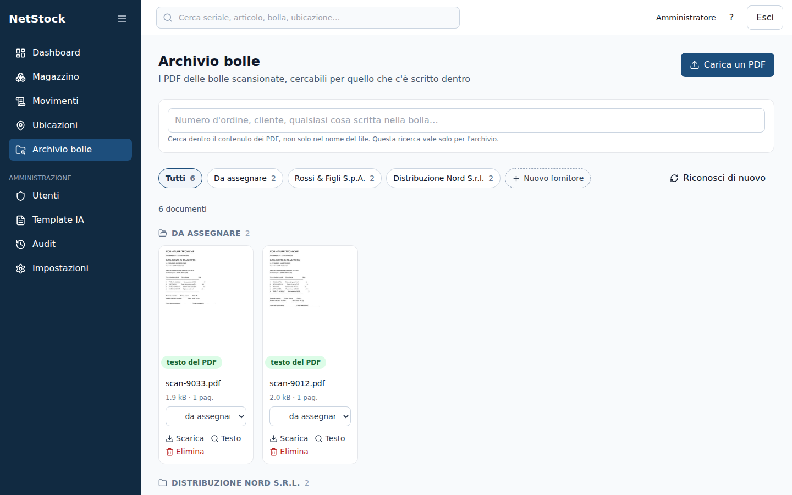

I PDF delle bolle scansionate, ritrovabili per **quello che c'è scritto dentro**, e separati da soli per fornitore. Come funziona: [Archivio delle bolle](#archivio-delle-bolle).

### Chi può fare cosa, e chi ha fatto cosa

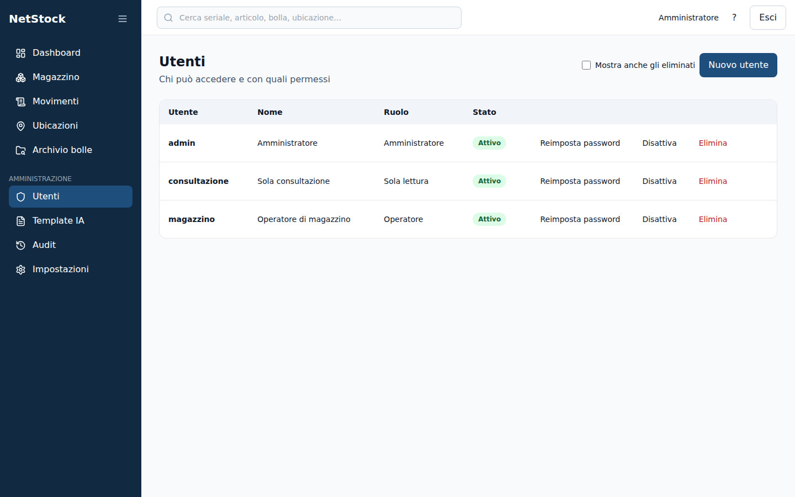

Tre ruoli — amministratore, operatore, sola consultazione — e un registro di controllo separato dal ledger.

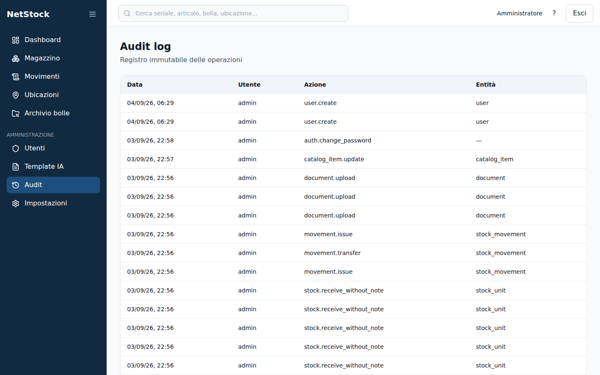

L'audit registra chi ha fatto cosa: carichi e scarichi, creazione e modifica di utenti, cambi di configurazione, storni, rottamazioni, documenti caricati. Gli accessi riusciti e le uscite no, di proposito — riempivano il registro senza dire niente che la tabella delle sessioni non dicesse già; i tentativi **falliti** invece restano, perché quelli qualcosa la dicono.

### La barra si riduce

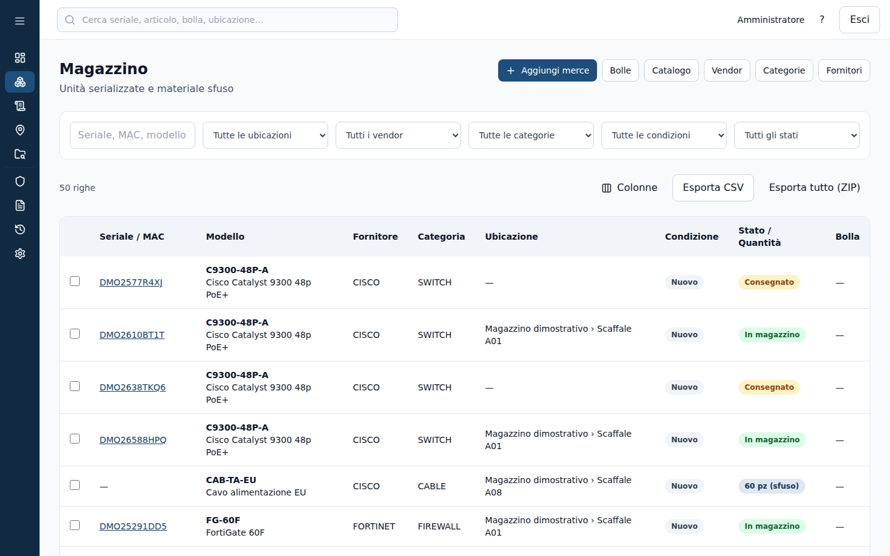

Il menu a tre righe in cima riduce la barra alle sole icone, per lasciare la pagina al contenuto. La scelta se la ricorda quel computer.

## Quickstart

```bash
git clone <repo> netstock && cd netstock
./install.sh
```

`install.sh` fa tutto: guarda cosa manca sulla macchina, lo installa e avvia il sistema. Chiede la password di amministratore **una volta sola e solo se serve davvero**, e annuncia ogni cosa prima di installarla. Si può rilanciare senza danni: quello che c'è già viene saltato.

| Comando | Effetto |
|---|---|
| `./install.sh` | Installazione interattiva |
| `./install.sh --controlla` | Dice solo cosa manca, senza installare né avviare niente |
| `./install.sh --senza-ai` | Installa senza il modello di estrazione (~3 GB in meno) |
| `./install.sh --si` | Non fa domande: accetta tutto (per automazioni) |

Installa, se mancano: Docker Engine e il plugin Compose (dal repository ufficiale di Docker, con la sua chiave di firma — non con uno script scaricato ed eseguito alla cieca), `curl`, `openssl`, `make`, e il runtime NVIDIA se trova una scheda video compatibile. Poi aggiunge l'utente al gruppo `docker` e passa la mano a `scripts/bootstrap.sh`.

**Requisiti minimi:** Ubuntu 24.04, Debian, Fedora o RHEL. 4 GB di RAM senza estrazione automatica, 8+ GB con. Una GPU NVIDIA non serve, ma cambia molto i tempi: vedi [Estrazione AI](#estrazione-ai-gpu-facoltativa).

Su una distribuzione diversa lo script si ferma e dice cosa serve: Docker Engine, il plugin Compose, `curl`, `openssl` e `make`, poi `./scripts/bootstrap.sh`.

## Aggiornamento

Su una macchina dove NetStock gira già, l'installatore non serve: salta tutto quello che trova a posto e lascerebbe in esecuzione la versione di prima. L'aggiornamento è il suo gemello.

```bash
./update.sh
```

| Comando | Effetto |
|---|---|
| `./update.sh` | Aggiornamento interattivo |
| `./update.sh --controlla` | Dice cosa cambierebbe — commit, migrazioni, voci nuove di `.env` — senza toccare niente |
| `./update.sh --si` | Non fa domande (per automazioni) |
| `./update.sh --senza-backup` | Salta il dump. Sconsigliato: è l'unica rete sotto una migrazione |

Nell'ordine: guarda cosa c'è di nuovo e lo mostra prima di scaricarlo, **fa e verifica un backup del database**, aggiorna il codice, aggiunge a `.env` le eventuali voci nuove *senza toccare quelle esistenti*, ricostruisce le immagini e riavvia. Le migrazioni partono con il container nuovo, che è l'unico a contenerle. Alla fine verifica `/health/ready`: se l'API non risponde, stampa il log e i due comandi esatti per tornare indietro — al commit di prima e, se serve, al dump appena fatto.

Non tocca i dati né la configurazione, e si può rilanciare: se non c'è niente di nuovo lo dice, e al massimo propone di ricostruire (utile quando il codice è arrivato con un `git pull` a mano, o quando un aggiornamento si è interrotto a metà).

Il backup finisce in `/var/backups/netstock`. Se lì non si può scrivere: `BACKUP_DIR="$HOME/netstock-backup" ./update.sh`.

> Su un'installazione più vecchia di questo script, la prima volta: `git pull && ./update.sh` — il `pull` porta `update.sh`, e lo script poi propone di ricostruire.

## Portare dentro il magazzino che c'è già

Un gestionale di magazzino diventa la fonte di verità solo quando contiene il magazzino. Battere a mano quello che sta nell'Excel non lo fa nessuno, e inventare bolle per merce arrivata anni fa falsifica il registro: per questo l'import esiste ed entra dalla porta giusta.

```bash
make import-catalogo FILE=catalogo.csv                       # prova a vuoto
make import-catalogo FILE=catalogo.csv APPLICA=1             # scrive
make import-giacenza FILE=giacenza.csv DATA=2026-01-07       # prova a vuoto
make import-giacenza FILE=giacenza.csv DATA=2026-01-07 APPLICA=1
```

**Senza `APPLICA=1` non viene scritto niente.** E la prova a vuoto non è una simulazione: fa il lavoro per davvero dentro una transazione e poi la annulla, quindi controlla con lo stesso codice che poi esegue — seriali doppi compresi.

Le colonne sono **quelle dell'esportazione** (`make backup` a parte, l'archivio di `Esporta tutto`): si esporta, si corregge in Excel, si reimporta.

| File | Colonne |
|---|---|
| catalogo | `Codice articolo`, `Nome`, `Fornitore`, `Categoria`, `Serializzato`, `Unità di misura`, `Punto di riordino`, `Formato seriale`, `Note` |
| giacenza | `Codice articolo`, `Seriale`, `MAC`, `Ubicazione`, `Condizione`, `Quantità` |

Fornitori, categorie e ubicazioni **devono esistere già**: crearli al volo da un CSV significa che un «CSICO» battuto male diventa un fornitore nuovo, e da lì in poi metà magazzino sta sotto un nome sbagliato. Un articolo già in catalogo viene saltato, non riscritto.

La giacenza importata **non è un inserimento nel database**: ogni pezzo passa dalla stessa funzione che registra la merce senza bolla, quindi ha la sua riga nel registro con data (`DATA=`, la data reale dell'inventario), autore e riferimento `GIACENZA-INIZIALE` — che è quello che permette di riconoscerla fra due anni.

## I template di lettura

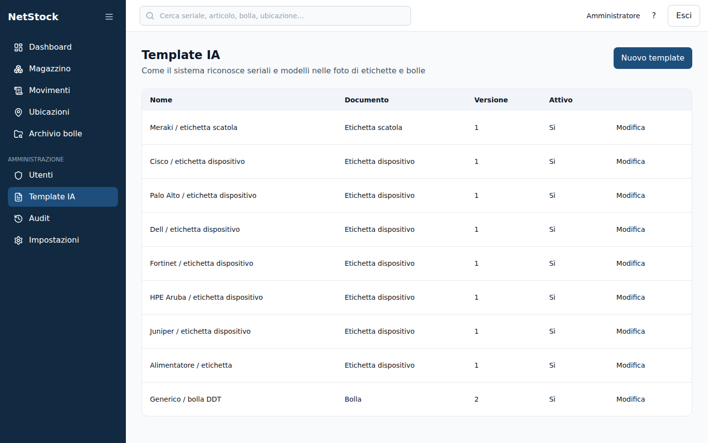

Un template dice come si riconosce un dato su un'etichetta o su una bolla: **che forma ha** il valore (il seriale Cisco è tre lettere, quattro cifre, quattro caratteri; quello Meraki è `Qxxx-xxxx-xxxx`), **vicino a quali parole** cercarlo (`S/N`, `SERIAL`, `MODEL`) e in quali codici a barre, e **dove va a finire** una volta trovato.

NetStock esce con i template di Cisco, Meraki, Fortinet, Palo Alto, Dell, HPE Aruba e Juniper, più uno per le etichette degli alimentatori e uno per la bolla italiana — che conosce le parole con cui è scritta davvero: «D.D.T.», «Vs. ordine», «Spett.le», «Documento di trasporto».

Non ce ne sono di più, ed è una scelta. Un template si aggiunge quando il seriale di quel costruttore ha una forma riconoscibile; dove il seriale è «una stringa alfanumerica» il template non riconosce niente, aggancia il primo codice che passa e **ruba l'etichetta a chi l'avrebbe letta bene**. Senza, resta il ripiego generico e l'operatore corregge; con un template largo, il dato sbagliato arriva già scritto nel campo e sembra giusto.

Quando arriva un formato nuovo si duplica il template più vicino e si cambia la forma del seriale: **niente codice, niente rilascio**. La stessa pagina ha un banco di prova — si carica una foto, si modifica il template e si vede cosa legge, senza scrivere niente a magazzino.

## Il modello che legge i documenti

In **Impostazioni** si sceglie quale modello legge bolle ed etichette, fra quelli installati, e la scelta vale dalla lettura successiva senza riavviare niente. Accanto ci sono i numeri che rispondono davvero alla domanda «conviene cambiare»: quanti secondi costa una lettura *su questa macchina*, presi dalle letture vere.

Si sceglie da un elenco e non si scrive a mano perché un nome vale solo se Ollama l'ha scaricato — sono gigabyte — e un campo libero permetterebbe di salvare qualcosa di plausibile e scoprire alla prima bolla che non c'è.

Per aggiungerne uno nuovo:

```bash
make ollama-pull MODEL=qwen3:8b
```

Non c'è un pulsante nella pagina, ed è una scelta: il servizio che legge i documenti **non ha una via d'uscita verso internet** (§7.5), ed è la misura che garantisce che il testo di una bolla non possa lasciare la macchina. Lo scaricamento lo fa un container temporaneo che monta lo stesso volume e poi sparisce.

## Archivio delle bolle

I PDF delle bolle scansionate si caricano in **Archivio bolle** e si ritrovano cercando quello che c'è scritto **dentro**: il file può chiamarsi `scan_001.pdf`, se contiene «n ordine DEMO-4471» lo trovi cercando `4471`. Funziona anche su un frammento.

Il testo si prende dal livello di testo del PDF quando c'è (le bolle che arrivano per posta), altrimenti con l'OCR (le fotocopie). Quale dei due sia stato usato è scritto accanto a ogni documento: serve quando una ricerca non trova, perché su una scansione storta l'OCR sbaglia qualche carattere — e «Testo letto» mostra esattamente ciò che il sistema ha letto.

**Le bolle si separano da sole per fornitore.** In cima c'è un pulsante per fornitore col numero di bolle che ha, più «Da assegnare». Il fornitore non viene inventato: viene riconosciuto fra quelli in anagrafica, con due prove in quest'ordine — la **partita IVA** stampata nel documento (undici cifre non capitano per caso) e il **nome nella testata**, cioè sopra la riga che annuncia il documento. Sotto quella riga comincia la bolla, e il nome di un'azienda lì dentro è il costruttore di quello che è stato consegnato, non chi l'ha consegnato: una bolla di dieci switch Cisco è del distributore, non di Cisco. Se combaciano due fornitori diversi non se ne sceglie nessuno.

Come si è arrivati al fornitore è scritto accanto a ogni riga — `partita IVA`, `intestazione`, `assegnato a mano` — perché un riconoscimento senza il suo perché costringe a controllarli tutti o a fidarsi di tutti. Il fornitore si cambia dall'elenco, e «Riconosci di nuovo» ripassa le bolle mai riconosciute con l'anagrafica di adesso: serve quando un fornitore lo si crea *dopo* aver archiviato le sue bolle.

**È una sezione stagna**: non compare nella ricerca globale in cima alla pagina, e ha la sua. La ricerca globale porta dritto a un pezzo in magazzino; qui si cerca dentro documenti che citano qualunque cosa, comprese merci mai registrate.

I PDF stanno nel database e non su un volume, quindi il backup notturno li copia insieme al resto: un archivio su disco risulterebbe vuoto al primo ripristino, con i riferimenti ancora al loro posto. Il prezzo è che i backup crescono con l'archivio — la pagina Impostazioni mostra quanto pesa ogni tabella.

## Certificato e telefoni

L'installazione genera un certificato autofirmato: funziona, ma ogni telefono passa da un avviso di sicurezza, e l'accesso alla fotocamera del lettore di barcode resta appeso a un'eccezione che Android e iOS trattano in modo diverso fra versioni — cioè la funzione su cui si è lavorato di più dipende dalla clemenza del browser.

```bash
make certs-ca && docker compose restart caddy
```

Genera una piccola autorità locale e le fa firmare il certificato. Installando **una volta** `certs/netstock-ca.crt` su ogni telefono e computer (le istruzioni per Android, iOS, Windows e Linux le stampa il comando), l'avviso sparisce e il lucchetto diventa verde.

Il compromesso, detto chiaramente: la chiave della CA resta su questa macchina, in `certs/` — escluso da git e leggibile solo dal proprietario. Per un magazzino su LAN è proporzionato; se l'azienda ha già una CA interna, la scelta giusta resta farsi firmare il certificato da quella.

Se la macchina cambia indirizzo, `./scripts/gen-selfsigned-cert.sh` dice per quali nomi vale il certificato attuale e quali servirebbero adesso.

## Disinstallazione

```bash
./uninstall.sh --controlla   # dice cosa toglierebbe, senza toccare niente
./uninstall.sh               # ferma e rimuove container e immagini: i dati restano
./uninstall.sh --dati        # rimuove anche il database
./uninstall.sh --tutto       # database, copie, .env, certificati, timer
```

**Senza argomenti i dati non si toccano.** L'applicazione sparisce, il magazzino resta nel volume, e un `./install.sh` lo ritrova com'era. Cancellare il database è un'altra cosa: si chiede per nome con `--dati`, e prima bisogna scrivere per esteso `CANCELLA I DATI`.

Prima di cancellare, lo script **fa una copia e la verifica**, e la mette in `~/netstock-archivio` — fuori dal repository e fuori da `/var/backups`, cioè fuori da tutto quello che i passi successivi possono rimuovere. Se la copia non riesce o non si rilegge, si ferma.

Non cancella la cartella del progetto (ci sta girando dentro) e non tocca le immagini di `postgres` e `ollama`, che possono servire ad altro sulla stessa macchina.

## Backup

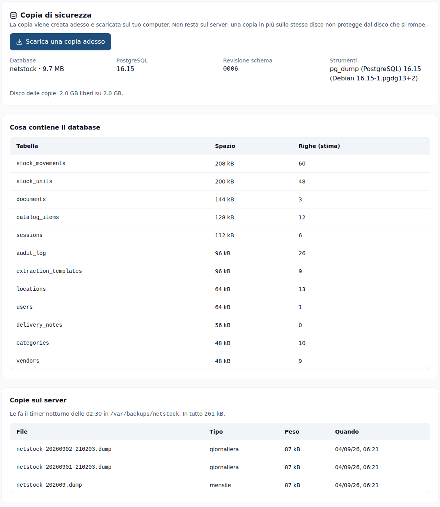

Da **Impostazioni** si scarica una copia del database sul proprio computer, si vede quanto pesa ogni tabella, quali copie ha lasciato il timer notturno e quanto spazio resta — e si ripristina una copia precedente. Il ripristino è l'unica operazione del sistema che **cancella dei dati**, e lo dice: prima di procedere salva lo stato attuale, e se qualcosa va storto lo rimette.

L'installatore propone un timer systemd che alle 02:30 copia il database; su un'installazione già esistente si attiva con `make backup-timer`. Conservazione: 30 copie giornaliere e 12 mensili in `/var/backups/netstock`.

Due cose che rendono quelle copie una garanzia invece di un proposito:

- **Fuori dalla macchina.** Imposta `BACKUP_REMOTE` in `.env` (un percorso montato o un bersaglio rsync). Senza, la sola copia dei dati sta sullo stesso disco del database che dovrebbe proteggere: basta contro un errore, non contro un disco che muore. Se la copia remota non riesce, il backup risulta **fallito** — perché un fallimento silenzioso si scopre il giorno peggiore.
- **Riaperte ogni tanto.** La domenica il dump appena fatto viene ripristinato in un database usa e getta e le righe si contano (`BACKUP_RESTORE_TEST=0` per saltarlo). A comando: `make backup-verify`. Un backup mai ripristinato non è un backup, è un file di cui ci si fida.

```bash
systemctl status netstock-backup     # esito dell'ultimo backup
journalctl -u netstock-backup        # cosa ha fatto
```

### Cosa fa `bootstrap.sh`

Chiamato da `install.sh`, oppure a mano se le dipendenze ci sono già:
1. verifica Docker/Compose/RAM/disco;
2. genera `.env` con segreti casuali e stampa **una sola volta** la password admin iniziale — salvarla subito;
3. genera un certificato TLS self-signed per l'IP/hostname della macchina (da sostituire con uno emesso dalla CA aziendale prima della produzione);
4. avvia il database ed esegue le migration Alembic (schema + seed);
5. se `EXTRACT_ENABLED=true`, scarica il modello indicato da `EXTRACT_MODEL` e avvia Ollama, con accelerazione GPU se ne rileva una;
6. avvia l'intero stack e verifica `/health`.

Al termine, l'applicazione è raggiungibile su `https://<IP-o-hostname-della-VM>`. Il browser mostra un avviso di sicurezza finché non si installa un certificato firmato dalla CA aziendale — è atteso con un certificato self-signed.

Al primo accesso l'utente `admin` deve cambiare la password (`must_change_password=true`).

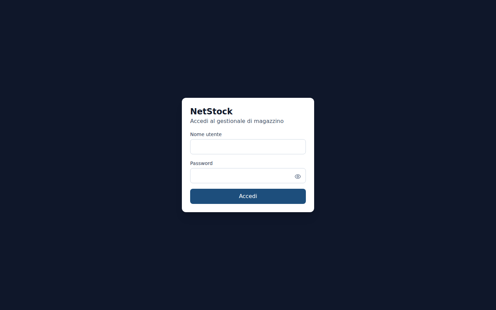

## Comandi comuni (`Makefile`)

| Comando | Effetto |
|---|---|
| `make update` | Aggiornamento di un'installazione esistente (`./update.sh`) |
| `make up` | Build e avvio dello stack (senza AI) |
| `make up-ai` | Come sopra con Ollama, usando la GPU se `nvidia-smi` risponde |
| `make ollama-pull` | Scarica il modello di estrazione (`MODEL=<nome>` per sceglierlo) |
| `make down` | Arresto dello stack |
| `make logs` | Log aggregati |
| `make migrate` | `alembic upgrade head` dentro il container `api` |
| `make reconcile` | Verifica `v_reconciliation_errors` (§6.6) |
| `make reconcile-fix` | Ricostruisce la proiezione delle unità dal ledger |
| `make backup` / `make restore` | Backup/restore del database |
| `make backup-timer` | Installa il backup notturno (timer systemd, 02:30) |
| `make backup-verify` | Riapre l'ultimo backup in un database usa e getta e conta le righe |
| `make test` | Test backend con coverage |
| `make lint` | ruff + mypy |

## Struttura del repository

```
netstock/
├── install.sh      Installatore: dipendenze, permessi, primo avvio
├── update.sh       Aggiornamento: backup, codice nuovo, ricostruzione, verifica
├── uninstall.sh    Rimozione: senza argomenti i dati restano
├── api/            Backend FastAPI (Python 3.12, async SQLAlchemy, Alembic)
├── web/            Frontend React 18 + TypeScript + Vite + Tailwind
├── docs/09-adr/    Architecture Decision Records
├── scripts/        bootstrap, backup, restore, certificato, download modello
├── compliance/     Licenze: whitelist, inventario generato, valori esaminati
├── docker-compose.yml, docker-compose.gpu.yml, Caddyfile, .env.example
```

## Estrazione AI (GPU facoltativa)

Dalla foto, dalla scansione o dal PDF di una bolla, il sistema propone le righe da ricevere. La divisione dei compiti è netta e non negoziabile:

- **barcode e regole deterministiche** decidono i valori;
- **il modello** decide solo la struttura — dove comincia una riga, quale colonna è la quantità consegnata e quale l'ordinata, quali righe non sono merce;
- **i numeri di serie non vengono mai prodotti dal modello**: sono ritagliati dal testo OCR e devono comparirvi alla lettera. Un seriale può mancare, mai essere inventato.

Nulla viene salvato senza conferma umana esplicita.

Formati accettati: JPEG, PNG, WebP, TIFF, BMP, GIF e PDF (multipagina, rasterizzato lato server).

**Con o senza GPU.** La lettura strutturale gira in entrambi i casi, ma i tempi sono molto diversi — sullo stesso documento, con lo stesso risultato: pochi secondi con una GPU NVIDIA, diversi minuti su 4 vCPU. Per questo l'analisi è asincrona: la lettura deterministica torna subito e la proposta del modello arriva quando è pronta, senza bloccare l'operatore.

La riserva GPU sta in `docker-compose.gpu.yml`, un override separato: `make up-ai` lo aggiunge solo se `nvidia-smi` risponde, così una macchina senza scheda video parte senza modifiche.

Il modello va scaricato con `make ollama-pull`, non con `ollama pull` dentro il container: la rete del servizio è `internal: true`, perché chi vede il testo OCR non deve avere una via d'uscita verso internet.

## Sviluppo senza AI

Impostare `EXTRACT_ENABLED=false` in `.env`: il gestionale funziona identico, semplicemente senza il pulsante di scansione da foto. `OLLAMA_BASE_URL` può anche puntare a un host esterno, senza modifiche di codice, se la VM è troppo piccola per Ollama.

## Documentazione

- [`docs/09-adr/`](docs/09-adr/) — Architecture Decision Records: le scelte non ovvie e il perché
- [`compliance/README.md`](compliance/README.md) — licenze di tutti i componenti, e le due cose che un inventario automatico non vede

## Il perché delle scelte

Le decisioni non ovvie — e i motivi per cui l'alternativa è stata scartata —
stanno negli [ADR](docs/09-adr/), uno per decisione.
